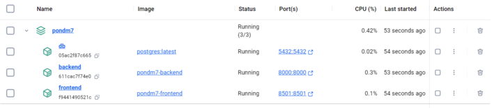

# Docker

O arquivo `docker-compose.yml` define três serviços principais: o banco de dados **PostgreSQL**, o **backend** em **FastAPI**, e o **frontend** em **Streamlit**. Todos os serviços estão conectados através de uma rede Docker chamada `crypto_network`.

Todos os serviços estão conectados através de uma rede chamada `crypto_network`, que utiliza o driver `bridge`. Isso permite que os contêineres se comuniquem entre si através de nomes de serviço (por exemplo, o backend acessa o banco de dados usando o nome de serviço `db`).

## Como Executar

1. Certifique-se de ter o Docker e o Docker Compose instalados em sua máquina.

[Docker Installation Guide](https://docs.docker.com/engine/install/)

2. Clone o repositório do projeto se ainda não o fez:

```bash
git clone https://github.com/rafaelarojas/pondm7
```

3. Suba os contêineres com o Docker Compose:
```
docker compose up --build
```
Caso esteja no Windows, o docker desktop aparece assim:



4. O Docker Compose irá baixar as imagens necessárias, construir os contêineres do frontend e backend, e iniciar os serviços. Você poderá acessar as aplicações nos seguintes endereços:

- Frontend (Streamlit): http://localhost:8501
- Backend (FastAPI): http://localhost:8000

## Justificativa: Não Utilização de Data Lake e Microserviços

### Data Lake
A implementação de um Data Lake não foi necessária neste projeto porque o sistema se baseia em previsões imediatas de criptomoedas e não requer a ingestão, armazenamento e processamento massivo de dados de diferentes fontes. Os dados são manipulados de forma estruturada e armazenados no banco de dados relacional PostgreSQL, que é suficiente para as necessidades atuais de armazenamento e consulta de logs e previsões. Além disso, os dados dos criptoativos são coletados através do `yfinance`, sendo assim não há necessidade de armazena-los.

### Microserviços

Apesar de a arquitetura atual utilizar contêineres para isolar o frontend, backend e o banco de dados, o projeto não segue a abordagem de microserviços completa. Isso se deve ao fato de que os serviços principais (frontend e backend) estão fortemente interconectados e o escopo do projeto é relativamente pequeno. A abordagem de microserviços seria benéfica em um cenário de escalabilidade maior ou quando os componentes precisam ser altamente independentes e mantidos por diferentes equipes.